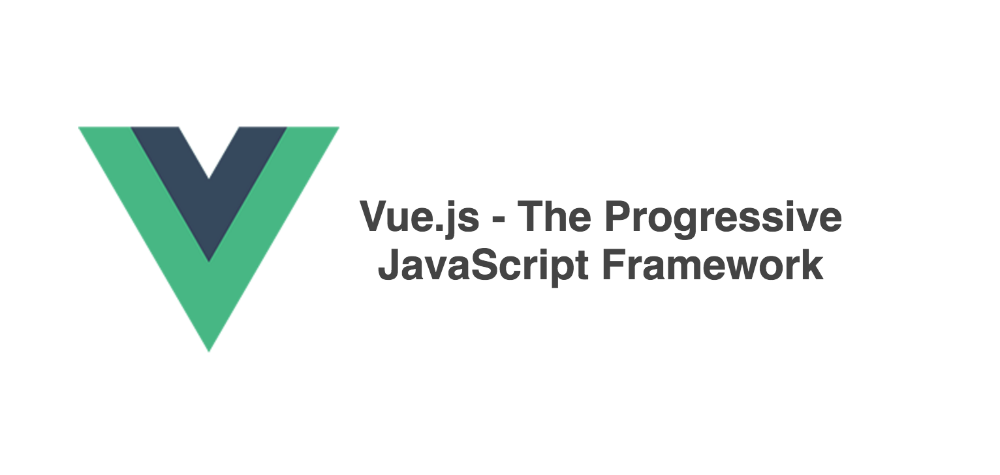

# Vue Rollup Boilerplate

> A simple rollup, [vue-loader](http://vuejs.github.io/vue-loader) and [esbuild](https://github.com/evanw/esbuild) setup for quick prototyping.



## Installation 

You can generate then [use this template](https://github.com/dangvanthanh/vue-rollup-boilerplate/generate)

## Usage

```bash
$ npm run serve
```

You can view the development server at `localhost:8080`

## Production build

```bash
$ npm run build
```

You can view the deploy by creating a server in `dist`

```bash
$ cd dist && npx serve
```

## Features

- [Rollup](https://rollupjs.org/guide/en/)
- [PostCSS](https://postcss.org/)
- [ESBuild](https://github.com/evanw/esbuild)
- [Prettier](https://prettier.io/)

## Fork It And Make Your Own

You can folk this repo to create own boilerplate.

## License

MIT © [Dang Van Thanh](http://dangthanh.org)
